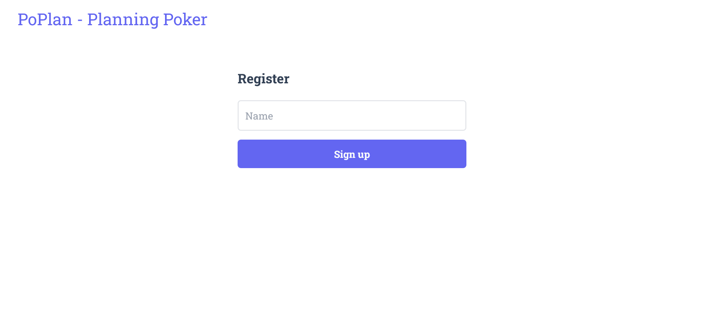
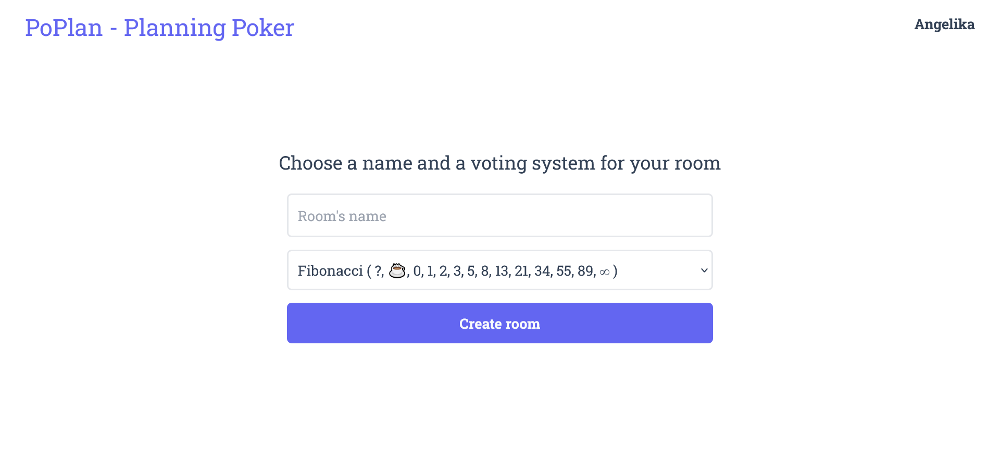
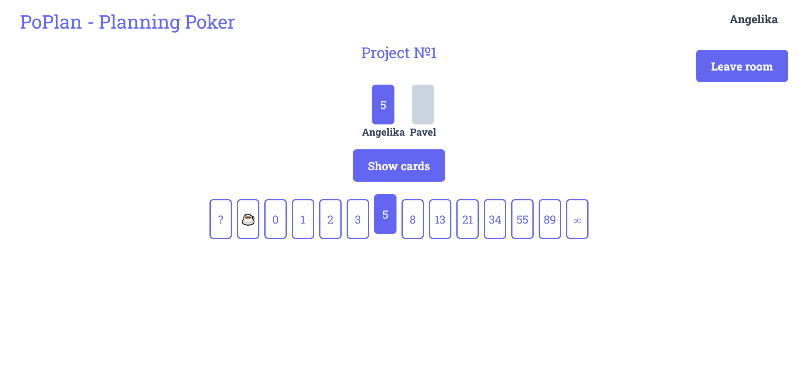
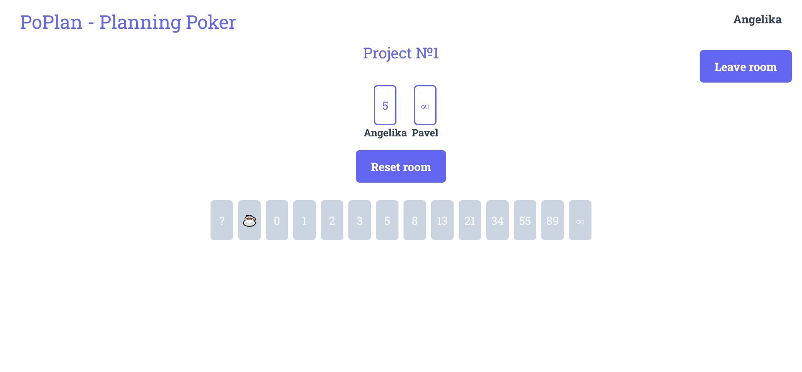

# PoPlan - Planning poker
This web application allows to use planning poker for estimating of tasks' complexity during the work on the project.\
The API for the project is [here](https://github.com/violarium/poplan).\
This project was built to practice working with **React**, **React router**, **Redux** and **TypeScript**.\
This project was bootstrapped with [Create React App](https://github.com/facebook/create-react-app).
## Features
The starting page shows the registration form

or the form for creating new room for the voting if the user is logged in.

When the room is created, the user is redirected to the room page. Following the link of the room page any user can join the voting in this room. Players pick the cards and can see only their own cards.

The owner of the room (the person who created it) can reveal the cards at any moment. When the cards are revealed the picking cards are unavailable.

The owner of the room also can reset the room which reset the votes to start a new voting.
## Technologies
During the development of this project these technologies were used:
* React 18.2.0
* Redux 4.2.1
* React-Redux 8.0.5
* Redux toolkit 1.9.3
* React router 6.8.2
* TypeScript 4.9.5
* WebSocket
